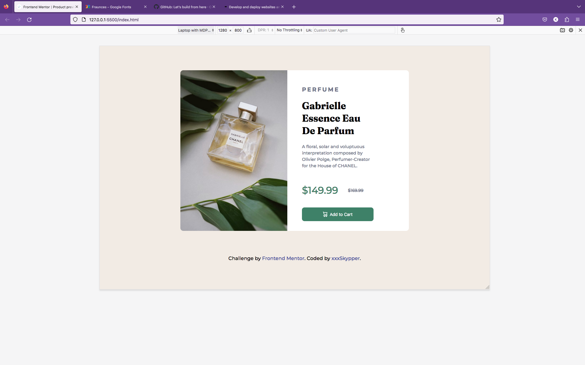
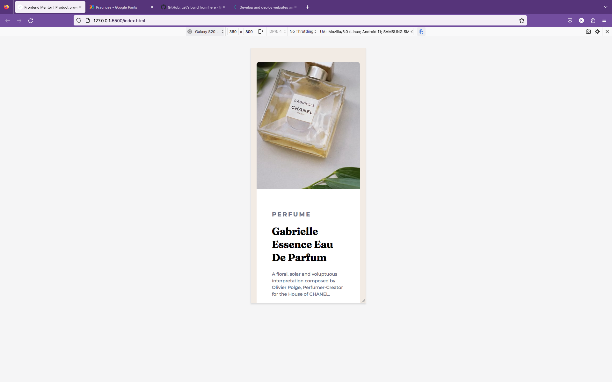
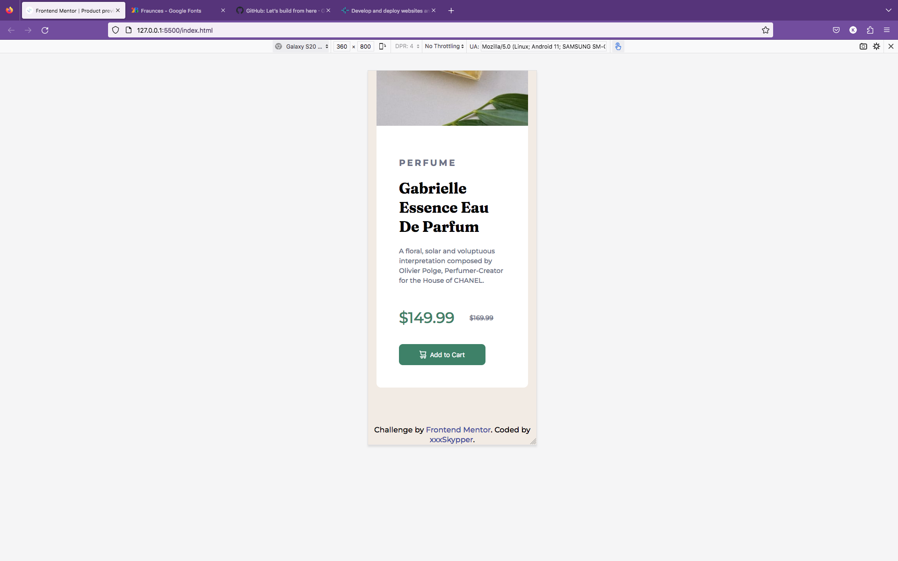

# Frontend Mentor - Product preview card component solution

This is a solution to the [Product preview card component challenge on Frontend Mentor](https://www.frontendmentor.io/challenges/product-preview-card-component-GO7UmttRfa). Frontend Mentor challenges help you improve your coding skills by building realistic projects. 

## Table of contents

- [Screenshot](#screenshot)
- [Links](#links)
- [Built with](#built-with)
- [Author](#author)

### Screenshot

### Links

- Solution URL: [xxxSkypper](https://github.com/xxxSkypper)
- Live Site URL: [Add live site URL here](https://your-live-site-url.com)

### Built with

- Semantic HTML5 markup
- CSS custom properties
- Flexbox

## Author

- Website - [xxxSkypper](https://www.github.com/xxxSkypper)
- Frontend Mentor - [@xxxSkypper](https://www.frontendmentor.io/profile/xxxSkypper)
- Twitter - [@xxx_Skypper](https://www.twitter.com/xxxSkypper)

